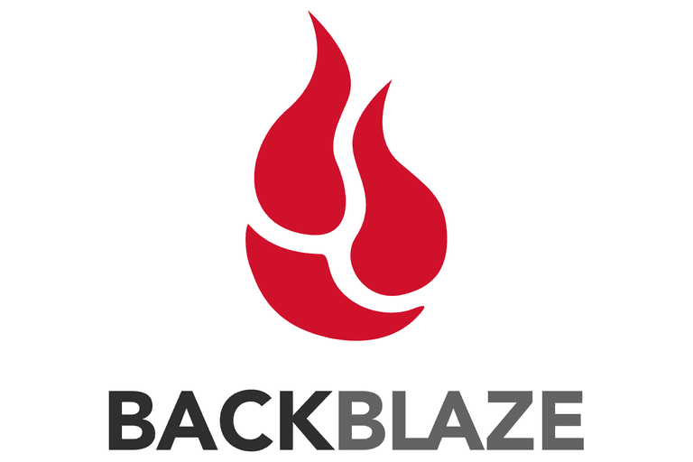

<h1 align="center">NTCHELP, INC.</h1>

NTCHELP, INC. specializes in remote technical support and maintenance for businesses. Previously offering on-site services, we have transitioned to a fully remote model after relocating to Georgia. Our business support is designed for efficiency, with expedited service available exclusively to existing clients with an established relationship.

## Leadership

Michael Carleton - CEO  
Heather Carleton - Secretary

## Contact Information

**Phone:** 530-676-6055

## Backup Solution

  

Everyone needs a proper backup service to protect their data from loss and/or theft. In most cases this service will cover your needs for a reasonable monthly/yearly price!

Backblaze will automatically keep a copy of all your files off-site with file history. This is sufficient to protect your data in most scenarios from loss! [Learn more](https://www.backblaze.com/cloud-backup.html#af9px9)
